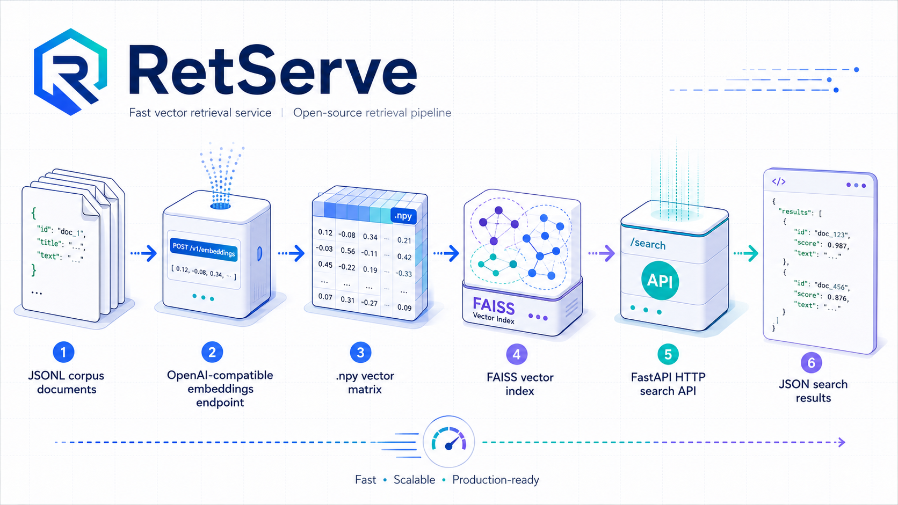

<p align="center">
  
</p>

# RetServe

[](LICENSE)


**RetServe** 是一个轻量检索服务：用任意 OpenAI 兼容 embedding endpoint，把 JSONL 语料转换成 FAISS 支撑的 HTTP 搜索 API。

[English](README.md) | [简体中文](README.zh.md)

```text
JSONL corpus -> /v1/embeddings -> .npy vectors -> FAISS index -> /search
```

## 为什么用 RetServe

- **链路简单**：离线编码和在线检索共用同一套 OpenAI 兼容 embedding 协议。
- **适合大语料**：流式读取 JSONL、批量请求 embedding、支持 mmap 建索引。
- **服务路径清晰**：FastAPI 接口、FAISS 检索、可选 GPU 加载、可配置并发。
- **配置类型化**：YAML 配置会解析为 Pydantic 模型，避免散乱字典。
- **endpoint 可替换**：支持 vLLM、One API、New API，或任何兼容 `/v1/embeddings` 的服务。

## 安装

```bash
uv sync
```

FAISS 会按平台选择。Linux x86_64 会安装适合 CUDA 12 服务器的 `faiss-gpu-cu12`；macOS、Windows 和非 x86 Linux 会安装 `faiss-cpu`。

也可以使用普通 pip 作为 fallback：

```bash
python -m venv .venv
. .venv/bin/activate
python -m pip install -r requirements.txt
```

GPU 包仍然可以跑 CPU 检索，并在 `index.use_gpu: true` 时支持把索引加载到 GPU。CPU 包不能使用 GPU 加速。PyPI 的 CUDA 12 wheel 会解析 CUDA 12.x runtime 依赖，但部署机仍需要兼容的 NVIDIA driver。macOS 没有 CUDA GPU 路径，Windows GPU 安装暂未验证。

真实 API key 建议放在环境变量中：

```bash
export RET_SERVE_EMBED_API_KEY="sk-..."
```

## 语料格式

RetServe 读取 JSONL，每行一个文档。`contents` 字段会被编码，并在服务返回时拆成 `title` 和 `text`。

```jsonl
{"id":"1","contents":"刘备\n刘备是三国时期蜀汉昭烈帝。"}
{"id":"2","contents":"诸葛亮\n诸葛亮辅佐刘备，擅长谋略。"}
```

生成 embedding 后不要改变 JSONL 行顺序，因为 FAISS ID 会映射到语料行号。

## 快速开始

### 1. 配置 embedding

编辑 `config/embed.yaml` 和 `config/serve.yaml`：

```yaml
embedding:
  url: "<your-openai-compatible-endpoint>/v1"
  model: "your-embedding-model"
  api_key_env: "RET_SERVE_EMBED_API_KEY"
  batch_size: 128
  concurrency_limit: 16
  normalize: true
```

编码和服务阶段应使用相同的 `url`、`model` 和 `normalize` 设置。

### 2. 生成向量

```bash
.venv/bin/python embed.py --config embed
```

命令会读取配置中的 JSONL 语料，并写出 `.npy` embedding 矩阵。

### 3. 构建 FAISS 索引

```bash
.venv/bin/python index.py --config index
```

默认索引为 `IndexFlatIP + IndexIDMap2`。如果 embedding 已归一化，内积检索可作为 cosine 相似度使用。

### 4. 启动服务

```bash
.venv/bin/python ret_serve.py --config serve
```

可访问：

- `GET /health`
- `POST /search`
- `GET /docs`

## API

检索请求：

```bash
curl http://localhost:8088/search \
  -H "Content-Type: application/json" \
  -d '{"queries":["诸葛亮和刘备的关系"],"topk":3}'
```

响应结构：

```json
{
  "contents": [
    [
      {
        "id": "2",
        "title": "诸葛亮",
        "text": "诸葛亮辅佐刘备，擅长谋略。",
        "contents": "诸葛亮\n诸葛亮辅佐刘备，擅长谋略。"
      }
    ]
  ],
  "scores": [[0.65]]
}
```

健康检查：

```bash
curl http://localhost:8088/health
```

## 配置文件

| 文件 | 用途 |
| --- | --- |
| `config/embed.yaml` | JSONL 语料 -> `.npy` 向量 |
| `config/index.yaml` | `.npy` 向量 -> FAISS `.index` |
| `config/serve.yaml` | HTTP 检索服务配置 |
| `config/log.yaml` | 日志级别和滚动文件输出 |

关键一致性规则：

- 编码和服务必须使用相同的 embedding 模型。
- 编码和服务应保持相同的归一化行为。
- 不要重复归一化，除非存储的 `.npy` 本来就是原始向量。
- 生成向量后不要重排语料。

## 项目结构

```text
src/
  corpus.py             JSONL corpus loader
  embedding_client.py   OpenAI-compatible embedding client
  embed.py              JSONL -> .npy pipeline
  index.py              .npy -> FAISS index pipeline
  ret_serve.py          FastAPI app and CLI entry point
  service_container.py  retrieval lifecycle and search orchestration
  vector_index.py       FAISS-backed vector index
config/
  embed.yaml
  index.yaml
  serve.yaml
  log.yaml
```

## 运行提示

- `server.max_topk` 用来限制高开销请求。
- `index.use_gpu` 会在服务启动时尝试把 FAISS index 放到 GPU。
- `index.search_concurrency_limit` 控制 CPU 检索并发；GPU 检索会为了安全串行执行。
- 大语料建议保持 `index.mmap: true`，并调节 `embedding.batch_size`、`embedding.concurrency_limit` 和 `index.chunk_size`。

## 贡献

欢迎提交 issue 和 pull request。如果改动影响检索行为，请说明测试时使用的 embedding 模型、归一化设置、语料假设和索引配置。

## License

RetServe 使用 [MIT License](LICENSE) 发布。

Copyright (c) 2026 Haidong Xin.
